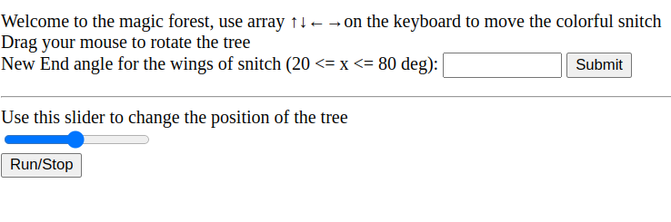
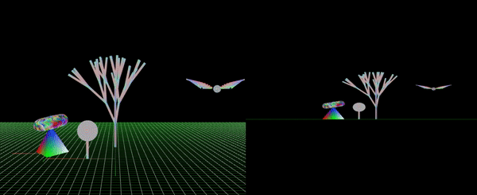
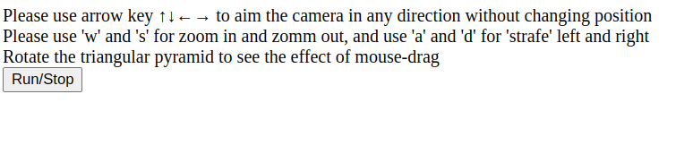
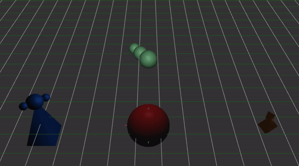
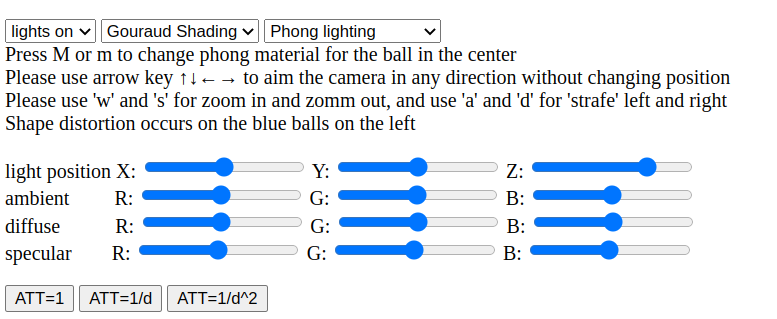

# ComputerGraphics

This repo is the homework for Computer Graphics.

### Instructions

1.clone the repository

2.open the html file under each directory with web browser, and follow the instruction on the screen to explore

### Result

###### Project A

This project shows some basic usage for WebGL functions.

###### Project B

This project demonstrates what camera perspective and orthographic view looks like.

###### Project C

The goal of this project is to use different lighting and shading method to simulate the animated
object.

